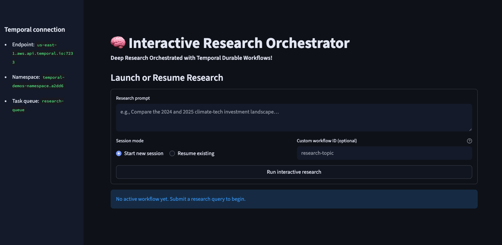

# Temporal Interactive Deep Research Demo using OpenAI Agents SDK

This repository builds on the Temporal Interactive Deep Research Demo by @steveandroulakis, adding a [Streamlit](https://streamlit.io/)-based user interface.


For detailed information about the research agents in this repo, see [openai_agents/workflows/research_agents/README.md](openai_agents/workflows/research_agents/README.md)
Access original repo [here](https://github.com/steveandroulakis/openai-agents-demos)


## Prerequisites

1. **Python 3.10+** - Required for the demos
2. ***Temporal Server*** - Must be running locally either from [Temporal Cloud](https://temporal.io) or locally at localhost:7233
3. **OpenAI API Key** - Set as environment variable `OPENAI_API_KEY` in .env file (note, you will need enough quota on in your [OpenAI account](https://platform.openai.com/api-keys) to run this demo)
4. **PDF Generation Dependencies** - Required for PDF output (optional)
5. **Streamlit** for UI Interface

## Run Temporal Server

### [Temporal Cloud](https://docs.temporal.io/develop/python/temporal-client#connect-to-temporal-cloud)

```bash
# Update Temporal Connection info in .env File (copy .env-sample to .env)
TEMPORAL_API_KEY=''
TEMPORAL_NAMESPACE=''
TEMPORAL_ENDPOINT=''
CONNECT_CLOUD='Y'
TEMPORAL_TASK_QUEUE='research-queue'
```

### Locally
```bash
# Install Temporal CLI
curl -sSf https://temporal.download/cli.sh | sh

# Start Temporal server
temporal server start-dev
```

## Setup

1. Clone this repository
2. Install dependencies:
   ```bash
   uv sync
   ```
   Note: If uv is not installed, please install uv by following the instructions [here](https://docs.astral.sh/uv/getting-started/installation/)

4. Set your [OpenAI API](https://platform.openai.com/api-keys) key:
   ```bash
   # Add OpenAI API key in .env file (copy .enn-sample to .env and update the OPENAI_API_KEY)
   OPENAI_API_KEY=''
   ```

## Running the Demos

### Step 1: Start the Worker

In one terminal, start the worker that will handle all workflows:

```bash
source .venv/bin/activate
```

```bash
uv run openai_agents/run_worker.py
```

Keep this running throughout your demo sessions. The worker registers all available workflows and activities.
You can run multiple copies of workers for faster workflow processing. Please ensure OPENAI_API_KEY is set before 
you attempt to start the worker. 

### Step 2: Run the Demo

In another terminal:

```bash
source .venv/bin/activate
```

```bash
streamlit run ui/streamlit_app.py
```
This will launch the Interactive Research App on http://localhost:8501




## About the Demo: Multi-Agent Interactive Research Workflow

An enhanced version of the research workflow with interactive clarifying questions to refine research parameters before execution and optional PDF generation.

This example is designed to be similar to the OpenAI Cookbook: [Introduction to deep research in the OpenAI API](https://cookbook.openai.com/examples/deep_research_api/introduction_to_deep_research_api)

**Files:**
- `openai_agents/workflows/interactive_research_workflow.py` - Interactive research workflow
- `openai_agents/workflows/research_agents/` - All research agent components
- `openai_agents/run_interactive_research_workflow.py` - Interactive research client
- `openai_agents/workflows/pdf_generation_activity.py` - PDF generation activity
- `openai_agents/workflows/research_agents/pdf_generator_agent.py` - PDF generation agent

**Agents:**
- **Triage Agent**: Analyzes research queries and determines if clarifications are needed
- **Clarifying Agent**: Generates follow-up questions for better research parameters
- **Instruction Agent**: Refines research parameters based on user responses
- **Planner Agent**: Creates web search plans
- **Search Agent**: Performs web searches
- **Writer Agent**: Compiles final research reports
- **PDF Generator Agent**: Converts markdown reports to professionally formatted PDFs

**Output:**
- `research_report.md` - Comprehensive markdown report
- `pdf_output/research_report.pdf` - Professionally formatted PDF (if PDF generation is available)

**Note:** The interactive workflow may take 2-3 minutes to complete due to web searches and report generation.

## Development

### Code Quality Tools

```bash
# Format code
uv run -m black .
uv run -m isort .

# Type checking
uv run -m mypy --check-untyped-defs --namespace-packages .
uv run pyright .
```

## Key Features

- **Temporal Workflows**: This demo uses Temporal for reliable workflow orchestration
- **OpenAI Agents**: Powered by the OpenAI Agents SDK for natural language processing
- **Multi-Agent Systems**: The research demo showcases complex multi-agent coordination
- **Interactive Workflows**: Research demo supports real-time user interaction
- **Tool Integration**: Tools demo shows how to integrate external activities
- **PDF Generation**: Interactive research workflow generates professional PDF reports alongside markdown

## License

MIT License - see the original project for full license details.
